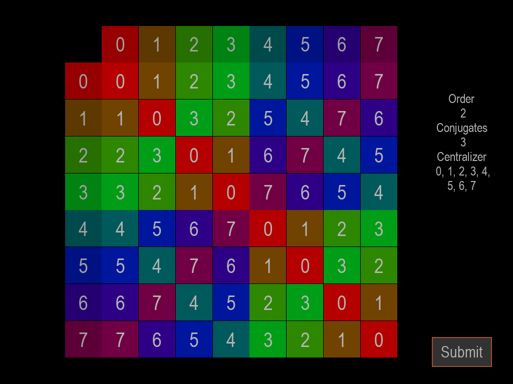

# Symmetry

Symmetry is an interactive game about group theory. In group theory, each finite group has a finite multiplication table that exhibits certain patterns and follows specific rules. By filling in missing information on the multiplication table, players can gain a deeper understanding of these rules.

This repository includes a group class that allows for some basic manipulation of groups. Additionally, a group identification function is provided to identify a group based on its multiplication table with orders up to 20.

The game is accompanied by a simple user interface implemented in Pygame.

How to play
To play the game, simply run the program and follow the on-screen instructions. Players will be presented with a partially filled multiplication table and must fill in the remaining cells based on the given information.

Advanced
With the ability to swap the indexing of elements, players can try to create longer composition series by placing the elements of the normal subgroups in the top left. In the later version of the game, I might consider adding a more advanced game mode in which the player is asked to give the longest composition series.
